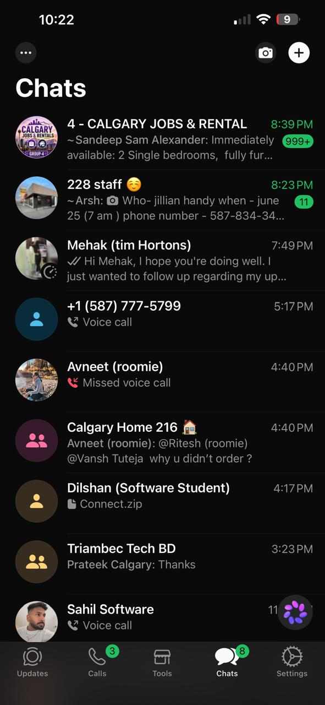
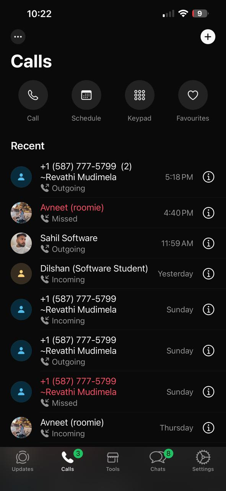
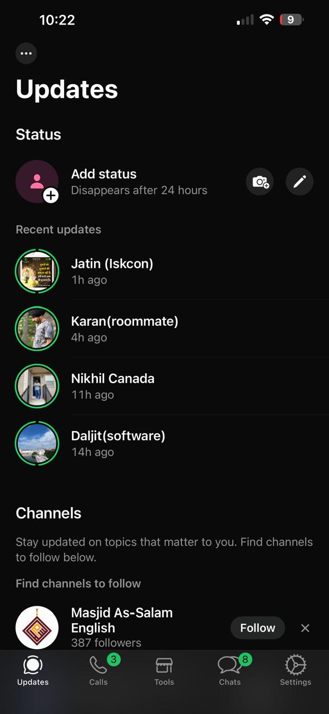
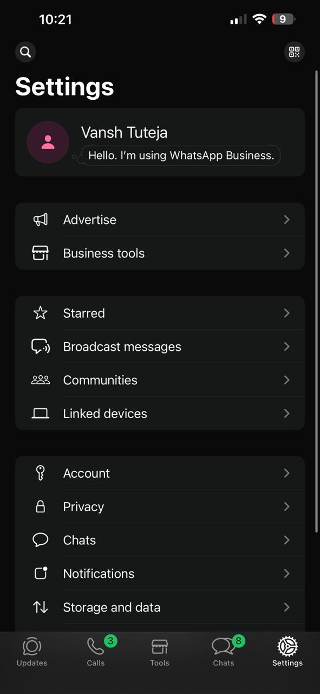
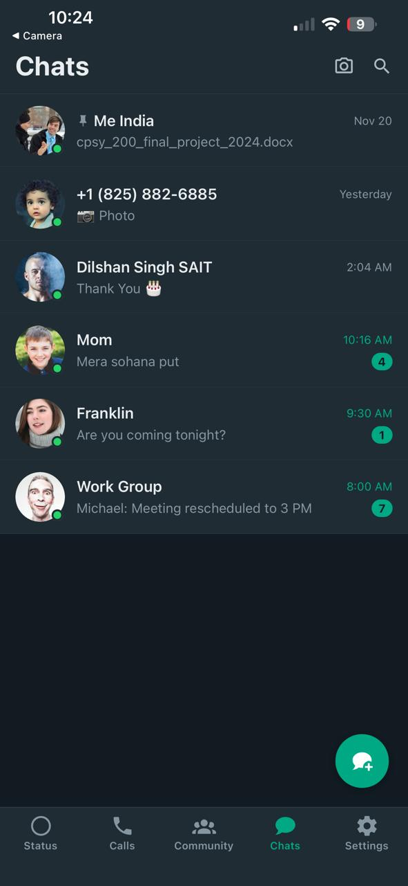
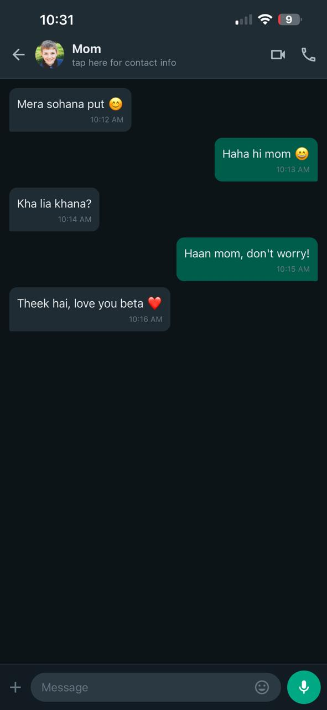
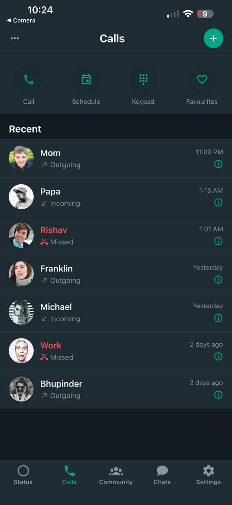
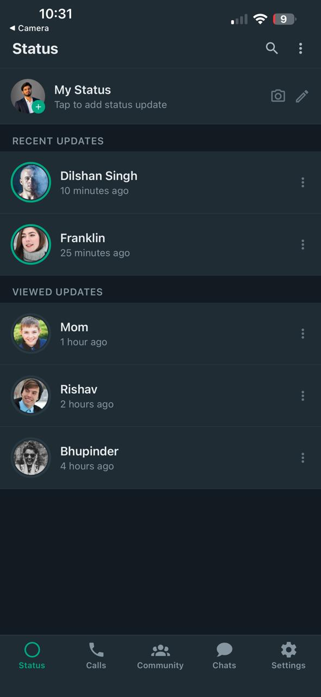
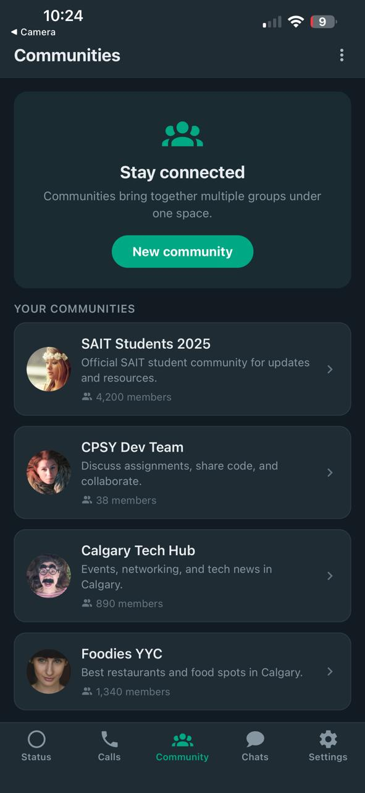

# Connect Chat - React Native

A WhatsApp-inspired mobile messaging application built with Expo and React Native as part of SAIT's **Advanced Multi-Screen Mobile Application with Collaborative Navigation (Expo)** assignment.

## Student

**Vansh Tuteja**

---

# Reference Screens

The following WhatsApp screens were used as references while recreating the user interface.

## Chats



## Calls



## Status



## Settings



---

# App Screenshots

## Chats Screen



## Chat Screen



## Calls Screen



## Status Screen



## Community Screen



---

# Features

- Multi-screen mobile application
- Bottom Tab Navigation
- Stack Navigation
- Dynamic chat list using FlatList
- Chat detail screen
- Status screen
- Calls screen
- Community screen
- Settings screen
- Dark / Light Theme Support
- Reusable components
- Responsive UI

---

# Technologies Used

- Expo
- React Native
- TypeScript
- Expo Router
- React Navigation

---

# How to Run

```bash
npm install
npx expo start
```

---

# About

This project recreates the interface and navigation of WhatsApp using modern React Native development practices. It demonstrates multi-screen navigation, reusable components, dynamic content, and theme support while following professional coding standards.